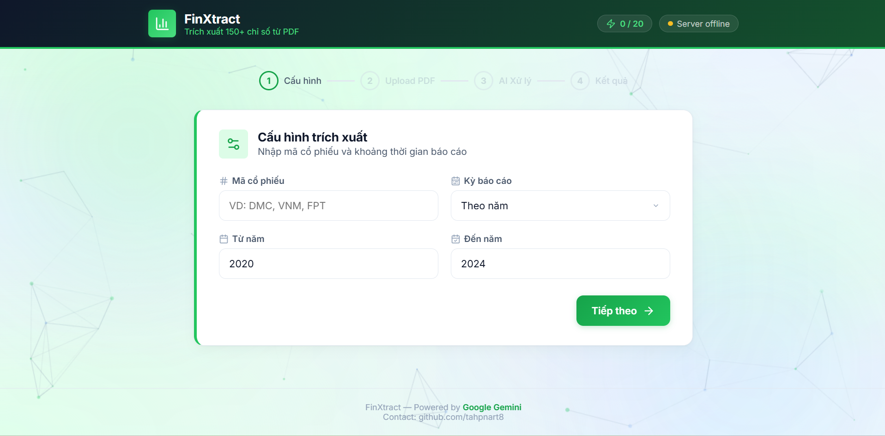

# 📊 FinXtract

> Hệ thống tự động trích xuất toàn diện 150+ chỉ tiêu tài chính từ Báo cáo Tài chính (PDF) sử dụng Google Gemini AI 2.5 Flash, với giao diện chuyên nghiệp chuẩn FiinPro-X.



## ✨ Tính năng nổi bật

- **Nhận diện PDF thông minh:** Xử lý tốt mọi loại BCTC, kể cả bản scan (ảnh) bị mờ hay nghiêng, nhờ năng lực đa phương thức (multimodal) của Gemini 2.5 Flash.
- **Trích xuất siêu chi tiết (150+ chỉ tiêu):** Lấy dữ liệu từ cả 3 bảng:
  - Bảng Cân đối kế toán (Balance Sheet)
  - Kết quả hoạt động kinh doanh (Income Statement)
  - Lưu chuyển tiền tệ (Cash Flow Statement)
- **Tự động mapping & xuất Excel:** Dữ liệu thô từ AI tự động được map chính xác vào file Excel mẫu (template chuẩn) để người dùng tải về lập tức.
- **Giao diện hiện đại (FiinPro-X Style):** UI/UX chuyên nghiệp, tối giản, tích hợp thanh trạng thái, tiến trình xử lý (Progress bar) và bộ đếm API Limit theo ngày.

## 🛠️ Tech Stack

- **Frontend:** HTML5, CSS3, Vanilla JS, Lucide Icons, SheetJS (XLSX).
- **Backend:** Python 3.11, FastAPI, Uvicorn, Gunicorn.
- **AI Core:** Google Gemini 2.5 Flash (`google-generativeai`).
- **Data Handling:** Pandas, Openpyxl.

## 🚀 Hướng dẫn cài đặt (Local)

### 1. Chuẩn bị

Bạn cần có một API Key của Google Gemini (miễn phí tại [Google AI Studio](https://aistudio.google.com/)).

### 2. Cài đặt Backend

```bash
cd backend
python -m venv venv

# Windows
venv\Scripts\activate
# macOS/Linux
source venv/bin/activate

pip install -r requirements.txt
```

### 3. Cấu hình biến môi trường

Tạo file `.env` trong thư mục `backend`:

```env
GEMINI_API_KEY=your_gemini_api_key_here
```

### 4. Chạy ứng dụng

Mở 2 terminal:

**Terminal 1 (Backend):**

```bash
cd backend
# Chạy với Uvicorn reload (Dành cho Dev)
uvicorn app.main:app --host 127.0.0.1 --port 8002 --reload
```

**Terminal 2 (Frontend):**

```bash
cd frontend
# Khởi tạo server tĩnh ở port 5500
python -m http.server 5500
```

Mở trình duyệt: `http://localhost:5500`

---

## 💡 Lưu ý về API Quota

Phiên bản miễn phí của Gemini (Free Tier) bị giới hạn **15 RPM (Request/Minute)** và **1,500 RPD (Request/Day)**. Tuy nhiên, hệ thống frontend được cấu hình giới hạn cứng ở **20 request/ngày** để đảm bảo ứng dụng không bao giờ bị dính lỗi `429 Too Many Requests` trong các phiên bản test. Quota được quản lý cục bộ (Local Storage) và tự động reset vào đầu ngày mới.

## 📄 License

MIT License
